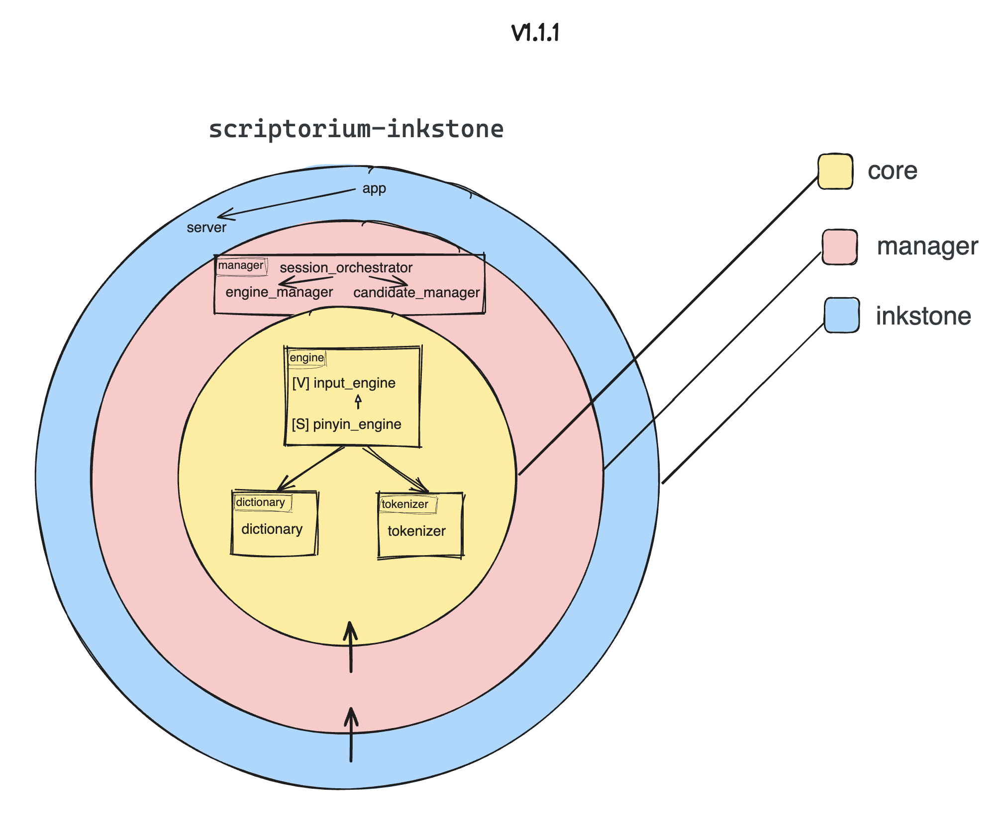

# Scriptorium Inkstone

[](https://github.com/ScriptoriumLab/scriptorium-inkstone/actions/workflows/scriptorium-inkstone-ci.yml)

[](https://opensource.org/licenses/Apache-2.0)

> The stateful input-method core of Scriptorium.

**Scriptorium Inkstone** is the platform-independent input-method engine of the [Scriptorium](https://github.com/ScriptoriumLab) ecosystem.

It owns the authoritative input-method state and performs the core work required to transform user input into composition state and candidate results, including Pinyin processing, segmentation, dictionary lookup, candidate generation, and ranking.

Inkstone runs outside the host application's process and communicates with platform integrations and presentation components through explicit protocol boundaries.

---

## Role in Scriptorium

Scriptorium separates platform integration, input-method logic, presentation, and shared infrastructure into independently evolving components.


Within that architecture:

- **[Scriptorium Brush](https://github.com/ScriptoriumLab/scriptorium-brush)** integrates with Windows through the Text Services Framework (TSF) and translates native input events into Scriptorium protocol messages.
- **Scriptorium Inkstone** owns input-method state and makes input-method decisions.
- **[Scriptorium Ink](https://github.com/ScriptoriumLab/scriptorium-ink)** renders user-facing state without owning input-method business state.
- **[Scriptorium Felt](https://github.com/ScriptoriumLab/scriptorium-felt)** provides shared protocols, IPC abstractions, and reusable infrastructure.

Inkstone is the single source of truth for input-method business state.

Platform adapters may observe and forward native events, and presentation processes may render state and report user actions, but neither owns the authoritative composition or candidate state.

---

## What Inkstone Owns

Inkstone is responsible for the state and behavior that define the input method itself.

### Composition State

Inkstone owns the current composition lifecycle, including:

- raw input
- normalized input
- active composition state
- committed and uncommitted text
- candidate navigation state
- selection state

This ensures that business state is not duplicated across platform or UI processes.

### Pinyin Processing and Segmentation

Inkstone interprets Pinyin input and determines meaningful segmentation boundaries.

This includes handling input forms such as:

```text
nihao
ni'hao
xi'an
```

Segmentation belongs to the engine because it affects dictionary lookup, candidate generation, and later user interaction.

### Dictionary Access

Inkstone owns access to dictionary data and the abstractions used to query it.

Dictionary implementation details remain behind explicit boundaries so that storage formats and lookup strategies can evolve without leaking into platform integrations or presentation code.

### Candidate Generation and Ranking

Inkstone produces candidate results from the current input state.

Responsibilities include:

- dictionary lookup
- candidate generation
- candidate ordering
- ranking
- paging state
- candidate selection

The presentation layer receives candidate state but does not decide what the candidates should be.

---

## State Ownership

A central architectural rule in Scriptorium is:

> The input-method core is the single source of truth for input-method state.

The interaction between Inkstone and Ink follows a unidirectional model:

```text
Inkstone → Ink : RenderState
Ink → Inkstone : UserAction
```

Ink receives state and renders it.

When the user interacts with the UI, Ink reports an action back to Inkstone.

Inkstone then decides how that action changes the authoritative state and produces a new `RenderState`.

This avoids maintaining competing copies of composition or candidate state in different processes.

The same principle applies to platform integrations: Brush forwards platform input and executes platform-specific commands, but input-method decisions remain inside Inkstone.

---

## Architecture

Inkstone separates input-method capabilities, application orchestration, and runtime composition into three explicit layers.

The architecture is organized around a simple dependency rule:

> Higher-level orchestration and runtime code may depend on inner input-method capabilities, while the core remains independent from application and process-level concerns.



The current architecture consists of three layers:

```text
┌──────────────────────────────────────────────┐
│                  Inkstone                    │
│            Application / Runtime             │
│                                              │
│                 app · server                 │
│                                              │
│   ┌──────────────────────────────────────┐   │
│   │               Manager                │   │
│   │        Application Orchestration     │   │
│   │                                      │   │
│   │  session_orchestrator                │   │
│   │  engine_manager · candidate_manager  │   │
│   │                                      │   │
│   │   ┌──────────────────────────────┐   │   │
│   │   │             Core             │   │   │
│   │   │   Input-Method Capabilities  │   │   │
│   │   │                              │   │   │
│   │   │ input_engine · pinyin_engine │   │   │
│   │   │ dictionary · tokenizer       │   │   │
│   │   └──────────────────────────────┘   │   │
│   └──────────────────────────────────────┘   │
└──────────────────────────────────────────────┘
```

### Core

The **Core** layer contains the fundamental capabilities that implement input-method behavior.

Current components include:

- `input_engine`
- `pinyin_engine`
- `dictionary`
- `tokenizer`

These components are responsible for the mechanics required to interpret input and produce meaningful input-method results.

For example:

- the input engine provides the abstraction through which input processing is performed
- the Pinyin engine implements Pinyin-specific input behavior
- the tokenizer determines valid segmentation of the current input
- the dictionary provides candidate data for those segments

The Core layer does not coordinate user sessions or process-level workflows.

It provides focused capabilities that can be composed by the layers above it.

This keeps input-method mechanisms independent from application orchestration.

### Manager

The **Manager** layer coordinates Core capabilities into complete input-method workflows.

Current components include:

- `session_orchestrator`
- `engine_manager`
- `candidate_manager`

Rather than implementing Pinyin parsing, tokenization, or dictionary lookup itself, this layer decides **when and how those capabilities participate in a user session**.

For example:

- `engine_manager` coordinates interaction with the active input engine
- `candidate_manager` manages candidate-related workflows
- `session_orchestrator` coordinates the overall input session and the collaboration between managers

This layer is therefore where individual input-method capabilities become stateful application behavior.

A useful distinction is:

> Core provides capabilities; Manager coordinates them into use cases.

### Inkstone

The outer **Inkstone** layer is the runtime and composition boundary of the process.

It contains application-level components such as:

- `app`
- `server`

This layer assembles the application, owns process lifecycle concerns, exposes Inkstone through its external communication boundary, and connects incoming requests to the Manager layer.

It should not contain input-method policy itself.

Instead, its responsibility is to construct and operate the application around the abstractions and workflows defined further inward.

Conceptually:

```text
External Event
      │
      ▼
    Server
      │
      ▼
   Managers
      │
      ▼
Core Capabilities
      │
      ▼
State / Result
```

The same separation applies in the opposite direction when Inkstone produces state or commands for other Scriptorium processes.

---

### Dependency Direction

Dependencies move inward:

```text
Inkstone → Manager → Core
```

The Core does not need to know:

- how Inkstone is hosted
- how requests arrive
- which IPC transport is being used
- which platform produced an input event
- how the resulting state is ultimately rendered

Likewise, the Manager layer coordinates input-method behavior without owning process transport or operating-system integration.

This boundary is important to Scriptorium's cross-platform direction.

Windows TSF integration belongs to Brush, UI rendering belongs to Ink, and shared transport and protocol infrastructure belongs to Felt.

Inkstone can therefore remain focused on the input method itself.

---

### Capability and Orchestration Separation

One of the main goals of this structure is to keep **mechanism** separate from **orchestration**.

For example, tokenization itself belongs to Core:

```text
tokenizer
```

but deciding when a session needs to tokenize the current composition, query the dictionary, update candidates, and produce a new state belongs to the Manager layer.

This avoids pushing workflow knowledge into otherwise reusable input-method components.

It also prevents Core components from gradually accumulating unrelated session and process responsibilities.

---

### Runtime Boundary

Inkstone is deliberately an out-of-process core.

However, process isolation is an architectural boundary around Inkstone rather than a concern that should leak throughout the input-method implementation.

The inner layers operate on Scriptorium models and abstractions rather than Windows TSF APIs or UI framework concepts.

As a result, the same Inkstone architecture can sit behind different platform integrations:

```text
Windows TSF ── Brush ──┐
                       │
                       ▼
                    Inkstone
                       ▲
                       │
future macOS adapter ──┘
```

The platform changes.

The input-method core does not need to.

---

## Design Principles

### Stateful Core, Stateless Presentation

Input-method state belongs to Inkstone.

The UI is intentionally treated as a renderer of state rather than another owner of that state.

This allows the UI process to restart, change technology, or evolve independently without redefining the input-method model.

### Platform-Independent Input-Method Logic

Inkstone should not need to understand Windows TSF, macOS InputMethodKit, or other platform integration APIs.

Platform-specific behavior belongs at the platform boundary.

The core instead operates on Scriptorium's platform-independent protocol and domain models.

### Infrastructure Behind Boundaries

IPC transports, serialization formats, dictionary storage, logging, and other technical choices are implementation details.

They should remain replaceable without requiring the input-method domain to change with them.

### Explicit State Ownership

Each piece of state should have a clear owner.

Inkstone owns input-method business state.

Brush owns platform integration state required to interact with the operating system.

Ink owns transient presentation concerns required to render the current state.

This avoids synchronization problems caused by multiple components treating their own copy as authoritative.

### Evolution Without Lock-In

Today's implementation choices should not unnecessarily constrain tomorrow's architecture.

Inkstone therefore favors stable abstractions around technologies that are expected to evolve, while keeping input-method behavior independent from those choices.

---

## Performance

Latency matters directly to the usability of an input method.

Inkstone therefore includes dedicated performance tests using **Google Benchmark**.

The performance suite is used to detect regressions in areas such as:

- input-event processing
- segmentation
- dictionary lookup
- candidate generation
- serialization and IPC-related processing
- behavior under larger input sizes

Performance measurements are treated as observations of a particular build and environment rather than permanent API guarantees.

This allows benchmark results to evolve honestly as the engine, dictionaries, protocols, compiler versions, and hardware change.

---

## Test Strategy

Inkstone uses multiple levels of testing because different failures require different forms of confidence.


### Unit Tests

Unit tests focus on isolated input-method behavior and data structures.

Examples include:

- Pinyin segmentation
- composition state transitions
- candidate selection
- dictionary behavior
- input-buffer manipulation
- ranking logic

These tests should remain fast and deterministic.

### Integration Tests

Integration tests verify behavior across component boundaries inside Inkstone.

Examples include:

- IPC request processing
- protocol conversion
- dictionary adapters
- process-level request and response flows
- reconnect and lifecycle behavior where applicable

The goal is to verify that independently tested pieces work correctly when composed.

### Performance Tests

Performance tests use Google Benchmark to track latency, throughput, scaling characteristics, and regressions.

Benchmarks are kept separate from correctness tests because they answer a different question:

> Not only does the engine produce the correct result — does it continue to do so within an acceptable performance envelope?

---

## Building

### Prerequisites

- CMake 3.25+
- a C++23-compatible compiler
- Ninja or another supported CMake generator

### Configure

```bash
cmake -B build -G Ninja
```

For performance measurements, prefer a Release build:

```bash
cmake -B build -G Ninja -DCMAKE_BUILD_TYPE=Release
```

### Build

```bash
cmake --build build
```

### Run Tests

Where the configured build exposes tests through CTest:

```bash
ctest --test-dir build --output-on-failure
```

Individual test executables can also be run directly while developing specific Inkstone components.

### Run Performance Tests

Build Inkstone in Release mode before running performance benchmarks.

For example:

```bash
./build/tests/performance_tests/scriptorium_inkstone_performance_tests.exe
```

Exact executable paths may vary by generator and platform.

---

## Project Status

Scriptorium Inkstone is under active development.

The current engine already includes the foundations for:

- input processing
- composition state
- Pinyin handling
- segmentation
- dictionary lookup
- candidate generation
- protocol-driven communication

Current and future work continues to refine areas such as:

- composition and candidate behavior
- segmentation and dictionary quality
- ranking
- state synchronization across process boundaries
- performance and latency
- reliability
- cross-platform boundaries

Detailed implementation work is tracked through GitHub Issues rather than maintained as a static task list in this README.

APIs, protocols, and internal structures may continue to evolve while Scriptorium approaches a more stable public architecture.

---

## Why "Inkstone"?

The Scriptorium repositories use traditional writing tools as an architectural metaphor.

An **inkstone** is where ink is prepared before it reaches the brush and eventually appears on the page.

Likewise, **Scriptorium Inkstone** is where raw input is transformed into meaningful input-method state before that state is presented to the user or committed through the platform integration layer.

It performs the reasoning and preparation behind the visible result.

---

## License

Licensed under the **Apache License 2.0**.

See `LICENSE` for details.

---

*Copyright © 2026 ScriptoriumLab.*
