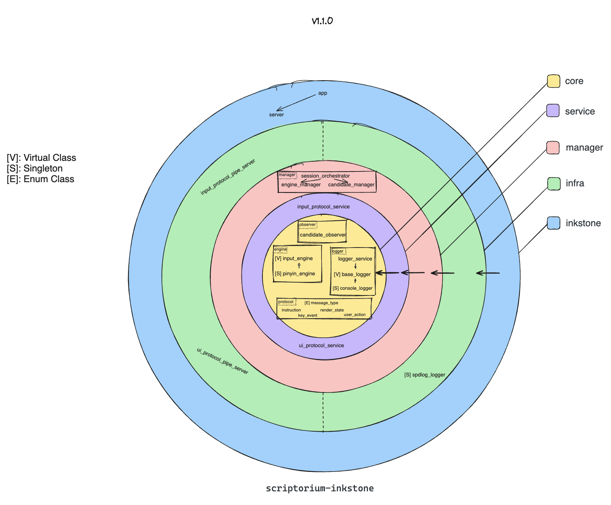
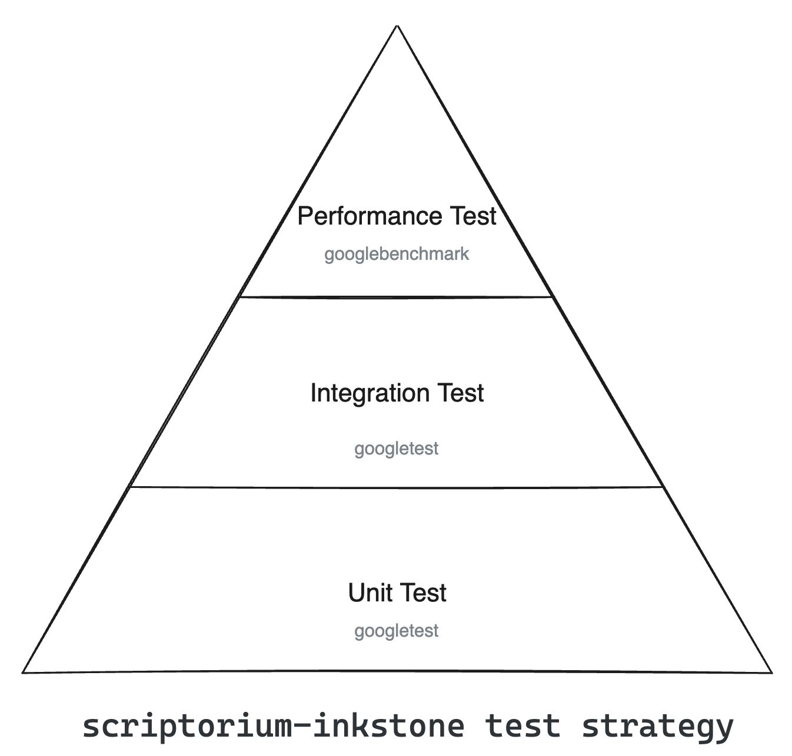

# Scriptorium Inkstone

[](https://github.com/ScriptoriumLab/scriptorium-inkstone/actions/workflows/scriptorium-inkstone-ci.yml)

```
=======================================================================================================================

 ,ggg, ,ggg,_,ggg,                                                               ,a8a,  ,ggg, ,ggg,_,ggg,     ,ggggggg,
dP""Y8dP""Y88P""Y8b                     8I                                      ,8" "8,dP""Y8dP""Y88P""Y8b  ,dP""""""Y8b
Yb, `88'  `88'  `88                     8I                                      d8   8bYb, `88'  `88'  `88  d8'    a  Y8
 `"  88    88    88                     8I   gg                                 88   88 `"  88    88    88  88     "Y8P'
     88    88    88                     8I   ""                                 88   88     88    88    88  `8baaaa
     88    88    88    ,ggggg,    ,gggg,8I   gg     ,gggg,gg   ,ggg,,ggg,       Y8   8P     88    88    88 ,d8P""""
     88    88    88   dP"  "Y8gggdP"  "Y8I   88    dP"  "Y8I  ,8" "8P" "8,      `8, ,8'     88    88    88 d8"
     88    88    88  i8'    ,8I i8'    ,8I   88   i8'    ,8I  I8   8I   8I 8888  "8,8"      88    88    88 Y8,
     88    88    Y8,,d8,   ,d8',d8,   ,d8b,_,88,_,d8,   ,d8b,,dP   8I   Yb,`8b,  ,d8b,      88    88    Y8,`Yba,,_____,
     88    88    `Y8P"Y8888P"  P"Y8888P"`Y88P""Y8P"Y8888P"`Y88P'   8I   `Y8  "Y88P" "Y8     88    88    `Y8  `"Y8888888

=======================================================================================================================
```

## 1. Introduction

**Scriptorium Inkstone** is the **Core Logic Server (The Brain)** of the Scriptorium IME ecosystem.

Designed as an **out-of-process** daemon, it handles all the heavy lifting: state management, Pinyin analysis, candidate ranking, and dictionary lookups. By decoupling the logic from the OS client (Brush), Inkstone ensures that complex calculations never block the user's UI thread and provides a crash-resistant architecture.

### Key Features
* **High Performance**: Built with **C++23**, optimized for microsecond-level latency (~17µs per key event).
* **Architecture Agnostic**: Pure C++ logic, free from Windows headers or macOS APIs.
* **Protocol Driven**: Communicates via high-speed IPC (Named Pipes) using a clean JSON protocol.

## 2. Architecture

Inkstone follows a strict **Onion Architecture** (Hexagonal Architecture) to ensure the core logic remains isolated from infrastructure details.



### The Layers
1.  **Core Layer (The Domain)**:
    * Contains pure business entities: `PinyinEngine`, `CandidateList`, `InputBuffer`.
    * **Constraint**: No external dependencies (no OS APIs, no IO).
2.  **Manager Layer (The Application)**:
    * Orchestrates the flow. `EngineManager` decides when to query the dictionary and when to commit text.
    * Manages the lifecycle of the input session.
3.  **Infra Layer (The Ports & Adapters)**:
    * **IPC Server**: Implements the Named Pipe server loop.
    * **Service Adapters**: Serializes/Deserializes JSON protocol messages.
    * **Logger**: Asynchronous logging (spdlog).

## 3. Test Strategy

Unlike the Brush (which focuses on Integration), Inkstone's testing strategy prioritizes **Performance** and **Algorithmic Correctness**.



### Level 3: Performance Tests (The Crown Jewel)
We use **Google Benchmark** to rigorously track the "speed of light" of our engine.
* **Micro-benchmarks**: Measure the latency of a single key press (IPC + Logic).
* **Big-O Complexity Analysis**: Verify that our algorithms remain $O(N)$ or better under heavy load (e.g., extremely long input strings).
* **RMS Monitoring**: Ensure system stability and low jitter (< 5% RMS).

### Level 2: Integration Tests
* **IPC Protocol Verification**: Ensure the server correctly handles connect/disconnect/reconnect events.
* **End-to-End Logic**: Verify that a sequence of inputs (e.g., "n", "i", "h", "a", "o") produces the correct candidate list via the IPC channel.

### Level 1: Unit Tests
* **Algorithm Testing**: Test specific Pinyin segmentation logic (e.g., splitting "xian" vs "xi'an").
* **Data Structure Testing**: Verify Trie/HashMap lookups and LRU cache behaviors.

## 4. Build & Run

### Prerequisites
* CMake 3.25+
* C++23 Compliant Compiler (MSVC 2022 / Clang 17+ / GCC 13+)
* Ninja (Recommended)

### Building
```bash
cmake -B build -G Ninja -DCMAKE_BUILD_TYPE=Release
cmake --build build
```

### Running Benchmarks
```bash
./build/tests/performance_tests/scriptorium_inkstone_performance_tests.exe
```

## 5. Roadmap
The current focus is on implementing the communication protocol and connecting the engine logic.
- [ ] Protocol Implementation
  - [ ] Integrate `nlohmann/json`.
  - [ ] Implement `Service Layer` to bridge IPC strings to Core Structs.
  - [ ] Define full JSON schema for `InputEvent` and `CandidateList`.
- [ ] Engine & Logic
  - [ ] Connect `PinyinEngine` to the IPC message loop.
  - [ ] Implement basic "Exact Match" dictionary lookup.
  - [ ] Implement paging logic for candidates.
- [ ] Infrastructure
  - [ ] Optimize Named Pipe buffer size.
  - [ ] Add support for multiple client connections (future proofing).
  - [ ] Introduce thread pool for handling IPC requests without blocking the main loop.

